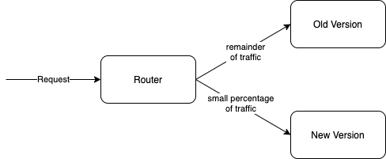
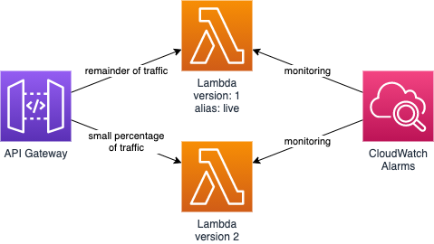

# Safer Lambda Deployments with CodeDeploy Canary Deployments

Without a good rollout and rollback strategy, there is greater risk of releasing breaking changes or broken software that impacts all users for an extended period of time. This can erode confidence in your releases and customers’ confidence in your products. 

Canary deployments can help minimise this risk by first routing a small percentage of traffic to the new version for a configured amount of time, before routing the remaining traffic to the new version. If any errors are detected during the initial routing then all traffic is routed back to the previous version.



AWS CodeDeploy provides native support for canary deployments of Lambdas. The AWS Serverless Application Model (SAM) provides abstractions to more easily configure CodeDeploy canary deployments of Lambdas using CloudFormation.

This example shows how to implement Lambda canary deployments using CodeDeploy and SAM, with the added bonus of a pre-traffic automated test Lambda for smoke testing the new version. CloudWatch Alarms trigger automatic rollback on increased error detection during the initial traffic shifting phase of the deployment.



## AWS Costs

By following these instructions you will create resources in AWS that could result in AWS costs.
It is recommended that you delete the CloudFormation stack for this example once you have finished experimenting with it.

## Prerequisites

[AWS CLI](https://docs.aws.amazon.com/cli/latest/userguide/install-cliv2.html)

## Deploying to AWS

```bash
aws cloudformation deploy \
--template-file sam.template.yaml \
--stack-name lambda-codedeploy-canary \
--capabilities CAPABILITY_IAM
```
